# 基于 AI Agent 的工业设备智能运维与预测性维护平台

**AI-Powered Industrial Intelligent Maintenance and Predictive Maintenance Platform**

[](https://github.com/ten10do/industrial-maintenance-copilot/actions/workflows/ci.yml)


将设备遥测、异常检测、真实试验数据故障预测、RAG 诊断、受控 Agent 运维决策、智能工单与人工审批串联为可追溯、可审计的工业运维闭环。系统默认使用软件设备模拟器与 Mock AI，无需真实设备或付费 API 即可运行完整业务流程。

> **Project Status**
>
> - Core engineering development: **complete**
> - Fault Model V2: **local non-production staging research**
> - RUL Model: **promotion rejected**
> - Production deployment of current `master`: **not performed**
> - Real PLC / SCADA / field sensor integration: **not performed**

## What This Project Does

- 采集或模拟设备遥测，监控工业电机与轴承健康状态。
- 通过 OPC UA 工业协议网关（read-only）接入软件模拟的工业设备层，遥测经数据质量校验后进入同一 AI 链路。
- 通过确定性规则执行数据质量检查、异常检测、健康评分与风险告警。
- 使用真实轴承试验台数据研究跨轴承 Fault Classification，并把合格结果接入受控 Staging。
- 对 XJTU-SY run-to-failure 数据开展 RUL Research，未通过 Promotion Gate 的模型不会进入 Staging。
- 结合设备手册、SOP 和历史案例，以 RAG evidence 支撑故障诊断与维修建议。
- 通过 Workflow Orchestrator 串联诊断、知识、决策、工单和调度步骤，并保留 Agent/Tool 审计轨迹。
- 管理智能工单、维修人员、技能、备件、审批和维修效果验证。
- 通过 Human-in-the-loop 阻止 AI 绕过审批执行高风险设备命令。

## End-to-End Maintenance Loop

ML 负责可复现的数值预测；Agent 负责消费已记录的 ML output、检索证据并协调业务流程。LLM 不直接预测 RUL，也不能直接停机。

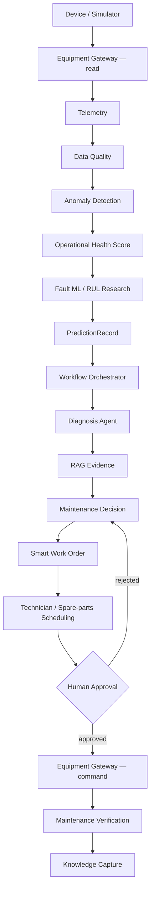

## Architecture

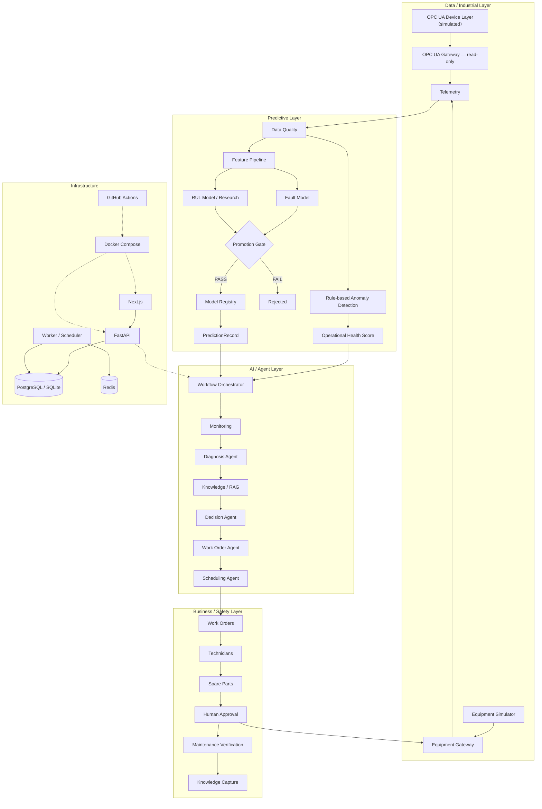

## Core Capabilities

| 领域 | 已实现能力 |
| --- | --- |
| 设备与遥测 | 资产档案、传感器、实时监测、固定随机种子的电机/轴承软件仿真 |
| 工业协议接入 | OPC UA Gateway（只读）、OPC UA 设备模拟器、DataChange 订阅（事件驱动）、节点映射配置、Data Quality Layer、工业报警流水线 |
| 检测与诊断 | 数据质量、九类故障规则、健康分、结构化诊断、证据与置信度 |
| 智能工单 | 上报、创建、分派、接单、执行、暂停、完工、验收、退回、状态审计 |
| 资源调度 | 技能/负载匹配、备件预留与缺口、维护窗口建议 |
| 安全与闭环 | 高风险操作审批、Equipment Gateway 隔离、维修验证、知识草稿沉淀 |
| 可观测性 | Dataset/Model lineage、PredictionRecord、AgentRun、ToolInvocation、审批轨迹 |

首期聚焦三相工业电机及轴承系统，架构可通过 Gateway、Provider 和设备类型扩展到泵、风机、压缩机、机床、机器人及 PLC 控制系统。

## Industrial Protocol Integration (OPC UA)

平台实现了 **OPC UA-compatible simulated industrial gateway**：数据链路从
`Simulator → AI Platform` 升级为
`OPC UA Device Layer → Gateway → Telemetry Pipeline → AI Maintenance Platform`。

- **只读接入**：网关仅读取 OPC UA 节点（NodeId / Value / Timestamp / Quality），
  代码级禁止写 PLC；未来写操作必须经过 Human Approval 审批流。
- **Data Quality Layer**：缺失值、坏质量标志、无效时间戳、单位换算与重复
  时间戳在进入业务前统一处理，不合格数据零落库。
- **配置化节点映射**：`opcua_node_mappings` 表 + `configs/opcua-node-mapping.yaml`
  （node_id → equipment + metric + unit + scale/offset），代码不硬编码 NodeId。
- **AI 能力不旁路**：通过质量校验的数据聚合为 `TelemetrySnapshot` 后调用既有
  `ingest_snapshot`，Health Score / 异常检测 / 故障预测 / 工单 / 审批全链路复用。
- **Mock 模式可运行**：无真实 PLC 时，由固定种子的软件 OPC UA Server
  （Industrial Motor 模拟器）完成完整 Demo。

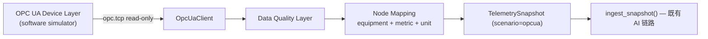

详细设计、Demo 命令与真实 PLC 接入路径见 [docs/opcua-gateway.md](docs/opcua-gateway.md)。
注意：当前为模拟工业网关，**尚未连接任何真实工厂 PLC**。

## OPC UA Event-driven Integration

在轮询网关之上，平台增加了 **simulated OPC UA subscription workflow**
（DataChange 订阅，事件驱动接入），轮询能力完整保留并作为订阅的 fallback：

- **Subscription 抽象**：`OpcUaSubscriptionClient` 协议 + Asyncua / Mock 双实现，
  不绑定具体协议栈；read-only 约束与轮询客户端一致；
- **DataChange Handler**：事件经 Node Mapping 与单事件质量闸门进入
  Event Buffer（batch aggregation + debounce + duplicate suppression，
  例如 1 秒内同一节点 10 次变化聚合为 1 个最新值）；
- **复用既有 AI 链路**：flush 时从最新值缓存构建 `TelemetrySnapshot` 并调用
  同一个 `ingest_snapshot`，不存在第二套 AI pipeline；
- **工业报警流水线**：NORMAL/WARNING/CRITICAL 状态机（阈值与平台告警一致，
  Alarm 位直接 CRITICAL），仅状态跃迁时产生/解除 `industrial_alarms` 记录，
  支持人工确认（acknowledge）；
- **确定性仿真**：`(seed, scenario, tick)` 唯一决定数值与变更集合，
  fault 场景起始 tick 振动突升、Alarm 置位，可完整演示事件驱动闭环。

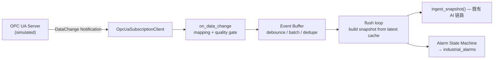

详细设计见 [docs/opcua-subscription.md](docs/opcua-subscription.md)。
注意：当前为模拟订阅工作流，**尚未连接任何真实工厂 PLC**。

## Predictive ML Research

项目不只是把模型包装成 API，而是实现了从官方数据来源到 Staging 的可审计研究链路。原始数据、处理后的完整数组和训练 artifact 均不提交 Git；CI 使用明确标注的 synthetic fixtures 验证工程链路。

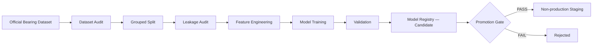

### Real Experimental Datasets

这里的“真实数据”是 **real experimental / test-rig data**，不是工厂生产数据。

| Dataset | 本地审计范围 | 研究用途 | License / 分发边界 |
| --- | --- | --- | --- |
| [Paderborn Bearing Data Center](https://mb.uni-paderborn.de/en/kat/research/bearing-datacenter/data-sets-and-download) | 32 bearings、2,560 MAT、受控轴承试验台 | Fault Classification / cross-bearing generalization | CC BY-NC 4.0；需署名，非商业；raw data 未提交 |
| [XJTU-SY](https://biaowang.tech/xjtu-sy-bearing-datasets/) | 15 run-to-failure bearings、9,216 CSV、3 operating conditions | Cross-bearing RUL Research | 作者公开来源未发现明确再分发 License；raw data 未提交 |

### Fault Model Research — V1 to V2

| Experiment | Evaluation | Macro Recall | Healthy Recall | PR-AUC | Status |
| --- | --- | ---: | ---: | ---: | --- |
| V1 HistGradientBoosting | Fixed Validation / best recall | 0.6764 | 0.0000 | 0.6300 | Rejected |
| V1 Random Forest | Fixed Validation / best PR-AUC | 0.6532 | 0.0006 | 0.7122 | Rejected |
| V2 F4 Random Forest | 26-bearing Grouped Development CV | 0.7904 | 0.6005 | 0.9482 | Passed research gate |
| V2 F4 Random Forest | One-time Frozen Test | 0.9867 | 0.9742 | 0.9999 | Non-production evidence |

Fault V2 修复了 V1 aggregate healthy-recall collapse，并达到 **non-production staging research criteria**。该结论必须与以下限制一起阅读：

- Frozen Test 只有 6 个独立轴承，其中只有 1 个健康轴承。
- 29,860 个窗口在轴承内部相关，不能视为 29,860 个独立样本。
- Development fold macro-recall standard deviation 为 0.2550，worst fold 为 0.4548。
- Development-only PCA 仍显示强烈的隐式 bearing-domain signal。
- 结果不代表 fleet generalization 或生产可用性；Fault V2 只进入本地、非生产 Staging。

详见 [V1 Fault 报告](docs/ml-experiments/paderborn-fault-v1.md)、[V1/V2 对比](docs/ml-experiments/v2-comparison.md)与 [Final Test 只读取证](docs/ml-experiments/v2/final-test-forensics.md)。

### RUL Research — Promotion Rejected

V2 最优未通过方案为 R0（15-bearing grouped cross-bearing estimate）：

| MAE | RMSE | R² | Late Error | Promotion |
| ---: | ---: | ---: | ---: | --- |
| 10.0543 h | 14.2737 h | -0.3288 | 2.0043 h | Rejected |

Dual-channel features 减少了部分轨迹跳变，causal context 进一步减少 oscillations，但 accuracy 没有改善。R0–R3 全部未同时满足 `MAE <= 5 h` 与 `R² > 0`，因此没有任何 RUL 模型进入 Staging、在线推理或 Agent/工单链路。

> **Not every trained model is allowed to ship.**

详见 [V1 RUL 报告](docs/ml-experiments/xjtu-rul-v1.md)、[V2 R0 报告](docs/ml-experiments/v2/rul-r0-v1.md)与 [V1/V2 对比](docs/ml-experiments/v2-comparison.md)。

## Model Governance

`DatasetVersion`、Feature Version、`TrainingRun`、`ModelVersion`、`ModelMetric` 与 `PredictionRecord` 记录 dataset、config SHA、Git SHA、artifact SHA256、feature schema、metrics 和 inference lineage。

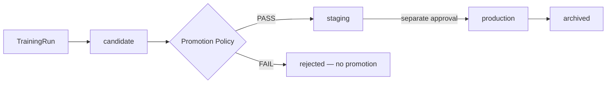

- Fault V2：仅在本地 registry 中进入 `staging`，`is_production=false`。
- RUL V2：Promotion Gate 失败，没有 registry entry 或 Staging inference。
- 默认在线推理只选择 `is_production=true` 的模型；显式 Staging inference 只写 `PredictionRecord`，不会创建业务 `RiskPrediction`。
- Artifact 只从可信训练流程加载，并校验路径、SHA256、model version 与 feature schema。

## Controlled Agent Workflow

这不是自由对话式 Multi-Agent Chat，而是有固定步骤、输入输出和审计记录的受控工作流：

`Workflow Orchestrator → Monitoring → Diagnosis → Knowledge → Decision → Work Order → Scheduling → Report / Knowledge Capture`

| Agent 可以 | Agent 不可以 |
| --- | --- |
| 综合已记录的 ML output 与设备状态 | 修改 ML probability、confidence 或 RUL |
| 检索 RAG evidence 与历史案例 | 修改 `ModelVersion` 或绕过 Promotion Gate |
| 生成带证据的维修建议 | 绕过角色、工单状态机或人工审批 |
| 建议工单、人员、技能与备件 | 自动执行高风险设备命令 |
| 解释决策并写入 Agent/Tool audit | 把低置信度推断声明为已确认根因 |

Staging probe 以 `dry_run` 运行六个步骤，不创建 RiskPrediction、工单、备件预留、调度变更或设备命令。详见 [Staging Safety Audit](docs/ml-experiments/v2/staging-safety-audit.md)。

## RAG-Grounded Diagnosis

RAG 检索范围包括：

- Equipment manuals
- Standard Operating Procedures（SOP）
- Historical maintenance cases

诊断与问答保留 source、citation 和 evidence。自动生成的维修案例先进入 `draft`，经人工审核为 `published` 后才参与后续检索；LLM Provider 不可用时回退到确定性结果并记录降级状态。

## Safety & Human Approval

即使模型输出 `failure probability = 100%`，系统也只能执行：

`Alert → Recommendation → Work Order → Approval Request`

未经主管或管理员审批、维护窗口与安全确认，不会调用 `EquipmentGateway.execute_command()`。批准、驳回、执行结果、审批人和时间均持久化；重复批准不会重复执行命令。

## Tech Stack

| Layer | Technology |
| --- | --- |
| Frontend | Next.js 15.1.12、React 19、TypeScript 5.7.2、Tailwind CSS 3.4.16、TanStack Query |
| Backend | Python 3.11、FastAPI 0.115.6、SQLAlchemy 2、Pydantic 2、Alembic versioned migrations |
| Data | PostgreSQL 16（CI / Docker Compose）、SQLite（本地默认）、Redis 7 |
| Async / Worker | Redis 协调的轻量 Python Worker/Scheduler heartbeat runtime；未引入 Celery |
| ML | scikit-learn 1.6.1、SciPy 1.15.3、NumPy 2.2.6、joblib 1.4.2 |
| AI | Provider abstraction、OpenAI-compatible optional provider、deterministic Mock、RAG、controlled Agent workflow |
| Infrastructure | Docker Compose、GitHub Actions、Netlify/Render 配置（仅 legacy deployment） |
| Testing | Pytest 8.3.4、Jest 29.7、Testing Library、Playwright 1.62 |

## Engineering Quality

最终研发基线：

| Check | Result |
| --- | --- |
| Ruff format / lint | PASS / PASS |
| MyPy strict | PASS，30 source files |
| Pytest | 138 passed |
| Backend coverage | 75.01% |
| Intelligent-maintenance service coverage | 85% |
| TypeScript strict / ESLint | PASS / PASS |
| Jest | 18 suites / 222 tests passed |
| Frontend coverage | Statements 59.10%，Lines 60.55% |
| Next.js production build | PASS，19 application pages |
| Playwright | 23 passed / 1 legacy production smoke skipped |

GitHub Actions 的 Backend quality、PostgreSQL 16 tests、Frontend quality、Frontend build、Docker Compose smoke 与 Playwright E2E 六个 Job 全部成功。CI 固定使用 Mock AI，不调用付费 API 或生产服务。

测试仍保留一项 SQLAlchemy Legacy API warning，以及部分 Jest React `act(...)` console warning；它们不影响当前质量门禁，但没有被隐藏或宣称已修复。

## Quick Start

普通 Demo 不需要 Paderborn/XJTU-SY 原始数据、训练 artifact、真实 PLC 或 API Key。默认启用 Mock AI、软件 Equipment Simulator 和演示数据。

### Docker Compose（推荐）

前置：Git 与 Docker Compose。

```bash
git clone https://github.com/ten10do/industrial-maintenance-copilot.git
cd industrial-maintenance-copilot
cp .env.example .env
docker compose up --build
```

Windows PowerShell 可使用 `Copy-Item .env.example .env`。启动后访问：

- Web：<http://localhost:3000>
- API：<http://localhost:8000>
- Swagger：<http://localhost:8000/docs>
- Readiness：<http://localhost:8000/ready>

停止本地环境：

```bash
docker compose down
```

### Manual Development

前置：Python 3.11+、Node.js 22+、npm 10+。

API：

```bash
cd apps/api
python -m pip install -r requirements.txt
python -m uvicorn app.main:app --host 0.0.0.0 --port 8000 --reload
```

Web（另一个终端）：

```bash
cd apps/web
npm ci
npm run dev
```

未设置 `DATABASE_URL` 时 API 使用本地 SQLite；未同时设置 `AI_ENABLED=true` 与有效 `LLM_API_KEY` 时使用 Mock AI。环境变量定义见 [`.env.example`](.env.example)。

本地开发默认在 API 启动时升级数据库。生产环境必须在部署阶段执行 `alembic upgrade head`，应用实例只校验 revision，避免多副本同时执行 DDL。

## Project Structure

```text
industrial-maintenance-copilot/
├── apps/
│   ├── api/                    # FastAPI、业务服务、ML、registry、tests
│   └── web/                    # Next.js、19 个页面、Jest、Playwright
├── configs/ml/                 # 锁定的训练与 Promotion Gate 配置
├── data/manifests/             # 数据来源、许可、checksum 与 split manifest
├── docs/ml-experiments/        # V1/V2 实验、泄漏审计与失败分析
├── scripts/                    # 数据审计、准备与可复现研究入口
├── .github/workflows/ci.yml    # 六项 CI Job
└── docker-compose.yml          # PostgreSQL、Redis、API、Web、Worker/Scheduler
```

## Legacy Public Demo

以下地址在 2026-08-04 核验可达，但对应较早的 **v1 work-order-focused release**，不代表当前 `master`。当前 Predictive ML、Fault V2、Model Registry 与 Staging research 均未部署到这些地址。

- Legacy Web：<https://industrial-maintenance-copilot.netlify.app>
- Legacy API：<https://industrial-maintenance-copilot-api.onrender.com>
- Legacy Health：<https://industrial-maintenance-copilot-api.onrender.com/health>
- Legacy API Docs：<https://industrial-maintenance-copilot-api.onrender.com/docs>

该公开环境使用虚构 demo data 与 Mock AI（Health 返回 `ai_enabled=false`）。历史环境配置过 `admin@example.com`、`supervisor@example.com`、`tech@example.com` 和公共演示密码，但本轮未重新验证登录凭据，不承诺仍可登录。

## Legacy Demo Screenshots

这些截图展示旧版工单、故障上报、知识库与 Mock Copilot，不包含当前 Predictive ML、Model Registry 或 V2 research UI。

| 主管仪表盘 | 故障上报 |
| --- | --- |
| 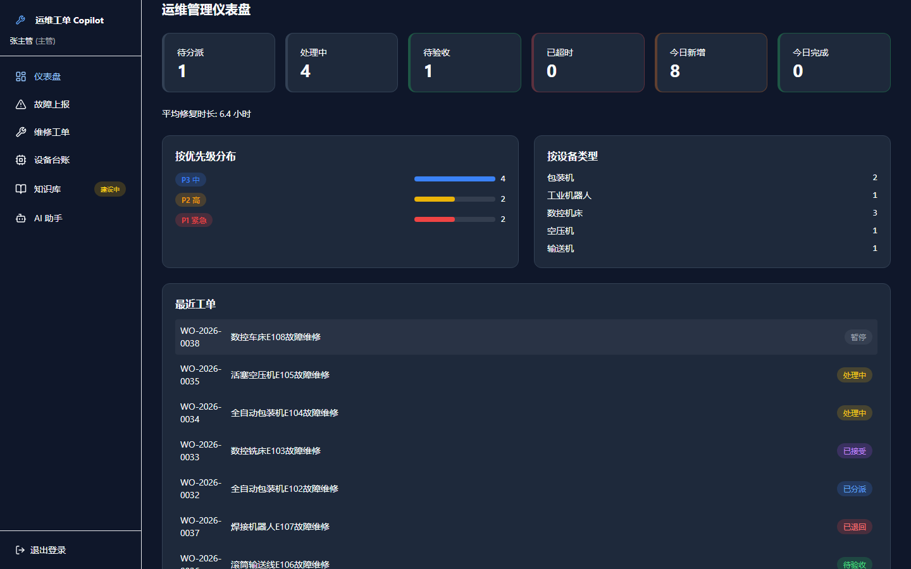 | 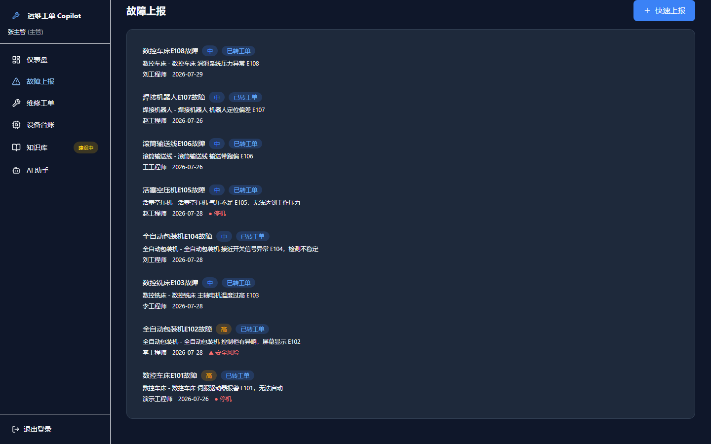 |

| 工单执行详情 | 知识库 |
| --- | --- |
| 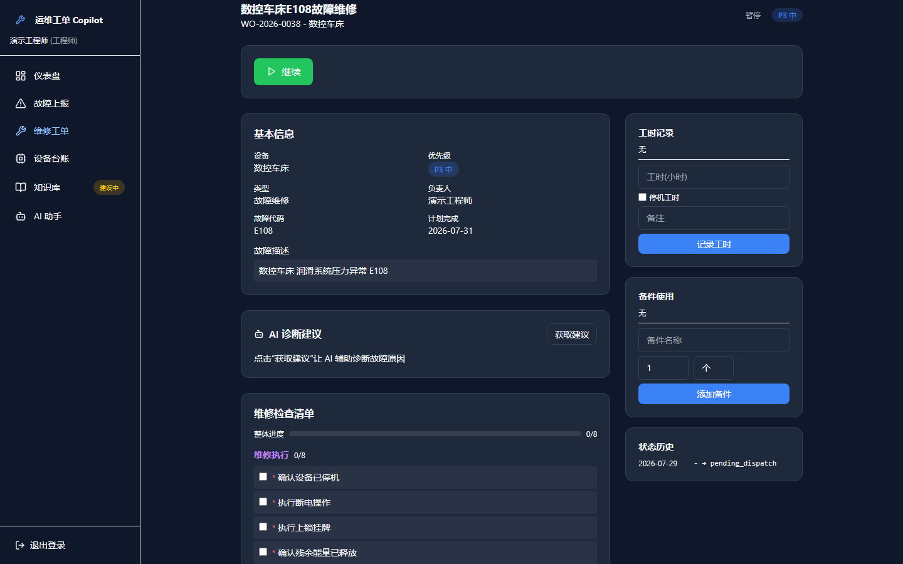 | 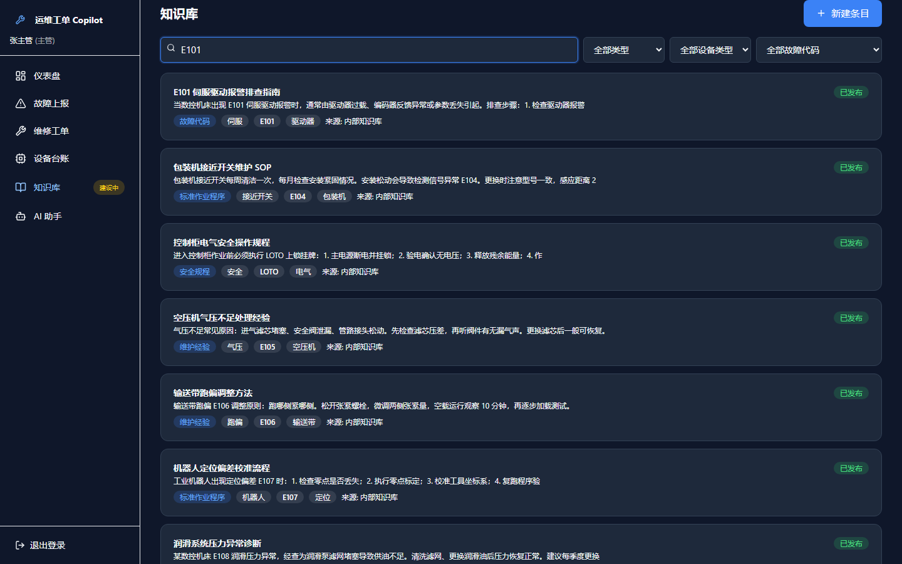 |

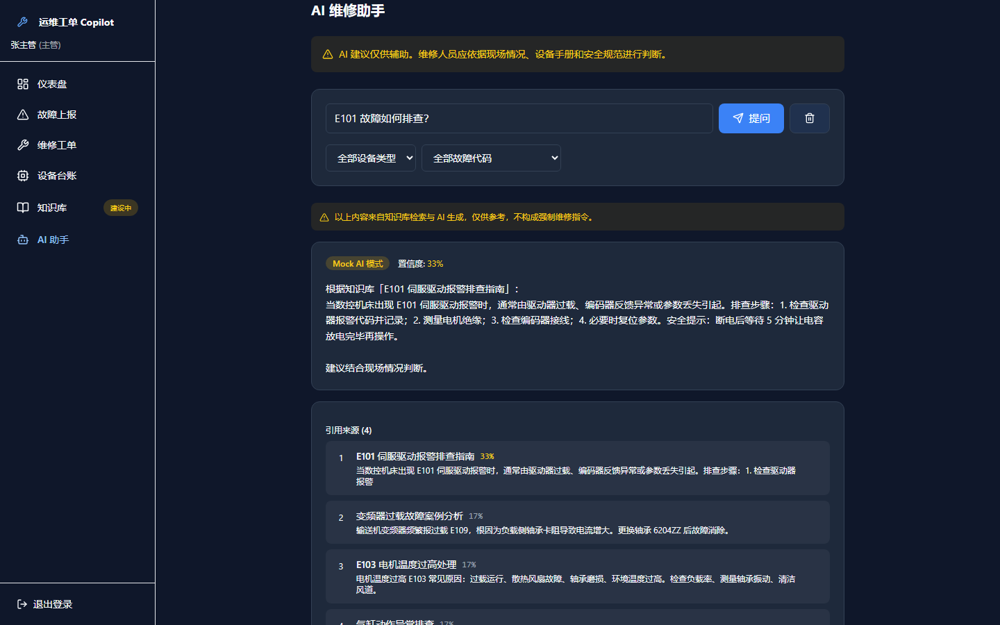

## Dataset & License Notice

- Paderborn 数据遵循 CC BY-NC 4.0；本项目的研究结果不建立商业使用权。
- XJTU-SY 作者来源要求引用论文，但未发现明确 LICENSE/SPDX 条款；公开可下载不等于允许再分发或商业使用。
- 仓库不提交原始 RAR/MAT/CSV、处理后的完整数组、SQLite registry 或 `joblib` 模型 artifact。
- 数据和模型只能通过 manifest、config SHA、Git SHA 与 artifact SHA256 追溯；使用者需自行确认原始数据授权。

## Known Limitations

- 数据来自受控 bearing test rigs，不是 factory fleet 或真实生产线。
- 未连接真实 PLC、SCADA、工业相机、物理传感器或生产网络；OPC UA 网关（轮询 + DataChange 订阅）当前为软件模拟形态（OPC UA-compatible simulation）。
- Fault Frozen Test 只有 6 个独立轴承，且只有 1 个健康轴承。
- 信号窗口在同一轴承内相关；window-level metrics 不能等同于独立设备泛化。
- Development Grouped CV 方差较高，worst-fold macro recall 为 0.4548。
- 传感器特征仍包含强隐式 bearing-domain signal。
- RUL V2 全部未通过 Promotion Gate，没有 RUL 模型进入 Staging。
- Paderborn 限于 CC BY-NC 4.0；XJTU-SY 再分发与商业使用权不明确。
- Alembic 从可接管既有数据库的 `20260811_01` 基线开始；基线之前没有可追溯 revision。
- 当前 `master` 尚未执行生产数据库迁移、模型 production promotion 或生产部署。
- 备件预留不执行 ERP 级库存扣减，附件持久化对象存储与多租户隔离未实现。

## Roadmap

研发阶段已经冻结；以下仅为 Future Work，不代表已排期：

- Modbus / PROFINET Equipment Gateway（OPC UA 只读网关与 DataChange 订阅已以软件模拟形态落地）
- Field telemetry integration（真实 PLC / SCADA 接入）
- OPC UA Alarm & Conditions（A&C）完整规范与证书认证
- Larger independent fleet validation
- External RUL benchmark with clear redistribution license
- 为后续结构变更持续增加可逆 Alembic revision

## Documentation

- [平台业务闭环](docs/intelligent-maintenance-platform.md)
- [系统架构](docs/architecture.md)
- [OPC UA 工业协议网关](docs/opcua-gateway.md)
- [OPC UA 事件驱动订阅](docs/opcua-subscription.md)
- [Controlled Agent workflow](docs/agent-workflow.md)
- [安全边界](docs/security.md)
- [真实数据与 Predictive ML Pipeline](docs/real-predictive-ml-pipeline.md)
- [Leakage Audit V1](docs/ml-experiments/leakage-audit-v1.md)
- [Paderborn Fault V1](docs/ml-experiments/paderborn-fault-v1.md)
- [XJTU-SY RUL V1](docs/ml-experiments/xjtu-rul-v1.md)
- [V1 / V2 Comparison](docs/ml-experiments/v2-comparison.md)
- [V2 Final Test Forensics](docs/ml-experiments/v2/final-test-forensics.md)
- [V2 Staging Safety Audit](docs/ml-experiments/v2/staging-safety-audit.md)
- [部署与回滚指南](docs/deployment.md)
