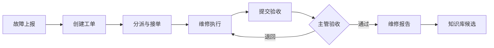
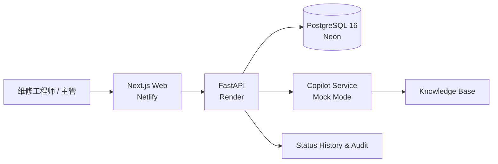

# Industrial Maintenance Copilot

[](https://github.com/ten10do/industrial-maintenance-copilot/actions/workflows/ci.yml)


工业设备运维工单 Copilot 覆盖故障上报、AI 辅助诊断、工单执行、主管验收、维修报告和知识沉淀，展示一套可审计的端到端运维业务流程。

> 本项目是工业运维业务与 AI 工程能力演示系统，不连接真实 PLC、SCADA 或生产设备，不应作为真实工业控制系统使用。

## Online Demo

- Web：[https://industrial-maintenance-copilot.netlify.app](https://industrial-maintenance-copilot.netlify.app)
- API：[https://industrial-maintenance-copilot-api.onrender.com](https://industrial-maintenance-copilot-api.onrender.com)
- Health：[https://industrial-maintenance-copilot-api.onrender.com/health](https://industrial-maintenance-copilot-api.onrender.com/health)
- API Docs：[https://industrial-maintenance-copilot-api.onrender.com/docs](https://industrial-maintenance-copilot-api.onrender.com/docs)

公开演示账号使用同一密码：`Demo123456`。

| 账号 | 角色 | 适合体验 |
| --- | --- | --- |
| `admin@example.com` | 管理员 | 系统管理与完整数据视图 |
| `supervisor@example.com` | 主管 | 分派、验收、退回和报表 |
| `tech@example.com` | 维修工程师 | 接单、执行、暂停、恢复和完工提交 |

公开环境只包含虚构演示数据，AI 固定使用 Mock 模式。演示账号不具备 Netlify、Render 或 Neon 平台权限。

## Screenshots

| 主管仪表盘 | 故障上报 |
| --- | --- |
|  |  |

| 工单执行详情 | 知识库 |
| --- | --- |
|  |  |


## Core Features

- 故障上报、结构化解析与一键转工单
- 工单创建、分派、接单、开始、暂停、恢复、完工、验收、退回和取消
- 服务端状态机、角色权限与非法转换拦截
- 安全检查清单、维修记录、工时、备件和附件
- 状态历史、分派历史、验收记录和审计轨迹
- 维修报告与知识库候选条目
- 知识检索和带来源引用的 Copilot 问答
- SQLite 零配置本地运行与 PostgreSQL 部署支持
- Docker、GitHub Actions 和公开环境 Smoke Test

## Business Workflow



核心状态流转：

```text
待分派 → 已分派 → 已接受 → 处理中 → 待验收 → 已完成
                       ↕ 暂停
                                  └→ 已退回 → 重新处理 → 待验收
```

- 主管或管理员负责创建、编辑、分派、验收、退回和取消。
- 被分派的维修工程师负责接单、执行、维修记录与完工提交。
- 完工前必须满足必做检查项，并填写根因、措施、测试结果、维修日志和工时等证据。
- 高风险工单必须补充完工照片；退回后已有证据保留，可修正后重新提交。

## Architecture



生产演示只维护一套部署：Netlify + Render + Neon。详细配置、重置与回滚步骤见 [部署指南](docs/deployment.md)。

## Tech Stack

| 层级 | 技术 |
| --- | --- |
| Web | Next.js 15.1.12、React 19、TypeScript、Tailwind CSS |
| API | Python 3.11、FastAPI、SQLAlchemy、Pydantic v2 |
| Database | PostgreSQL 16（公开环境）/ SQLite（本地默认） |
| AI | 可插拔 OpenAI 兼容接口；公开环境为确定性 Mock |
| Test | pytest、Jest、Testing Library、Playwright |
| Delivery | Docker、Docker Compose、GitHub Actions |

## Engineering Highlights

- 事务内状态转换与权限校验，拒绝未定义的跨状态操作
- 幂等数据库兼容迁移和空库 Seed
- 三重确认保护的演示数据重置脚本，无公开重置接口
- Next.js 同源 `/api` 代理，避免浏览器暴露数据库或服务端密钥
- CI 使用 PostgreSQL 16，覆盖后端、前端、迁移和真实浏览器 E2E
- 健康检查同时验证 API 进程和数据库连接

## Test Coverage

当前发布基线：

| 范围 | 结果 |
| --- | --- |
| Backend | 82 passed |
| Frontend | 16 suites / 220 tests passed |
| Playwright local E2E | 21 passed |
| Public demo Smoke | 1 passed |
| TypeScript / ESLint | 0 errors |
| Next.js production build | passed |

公开 Smoke 使用 `@playwright/test`，与本地完整 E2E 分开执行。

## Local Development

前置要求：Python 3.11+、Node.js 22+、npm 10+。

启动 API：

```bash
cd apps/api
python -m pip install -r requirements.txt
python -m uvicorn app.main:app --host 0.0.0.0 --port 8000 --reload
```

启动 Web：

```bash
cd apps/web
npm install
npm run dev
```

本地地址：

- Web：<http://localhost:3000>
- API：<http://localhost:8000>
- Swagger：<http://localhost:8000/docs>

未设置 `DATABASE_URL` 时，API 使用 `apps/api/maintenance.db`。空库首次启动会创建结构并填充演示数据。

## Docker

```bash
docker compose up --build
docker compose ps
docker compose logs -f
docker compose down
```

容器服务地址仍为 Web `http://localhost:3000` 和 API `http://localhost:8000`。

## Environment Variables

后端以代码实际变量为准：

| 变量 | 用途 | 默认值 |
| --- | --- | --- |
| `APP_ENV` | 运行环境 | `development` |
| `DATABASE_URL` | SQLite 或 PostgreSQL 连接串 | 空，使用 SQLite |
| `SECRET_KEY` | JWT 签名密钥 | 仅本地占位值 |
| `FRONTEND_URL` | 唯一允许的生产前端 CORS Origin | `http://localhost:3000` |
| `AI_ENABLED` | 启用真实模型 | `false` |
| `LLM_API_BASE` / `LLM_API_KEY` / `LLM_MODEL` | OpenAI 兼容模型配置 | Mock 时不需要 Key |
| `SEED_ON_STARTUP` | 空库自动 Seed | `true` |

前端服务端使用 `API_BASE_URL` 生成同源 `/api` rewrite。浏览器只访问相对路径，不需要公开数据库、JWT 或 LLM Secret，也不需要重复配置 `NEXT_PUBLIC_API_URL`。

复制 [`.env.example`](.env.example) 后仅在本机填写值；不要提交 `.env`。

## Validation Commands

```bash
# Backend
cd apps/api
python -m pytest

# Frontend
cd ../web
npm run typecheck
npm run lint
npm test -- --runInBand
npm run build
npm run test:e2e

# Public demo smoke
PUBLIC_DEMO_SMOKE=true \
E2E_BASE_URL=https://industrial-maintenance-copilot.netlify.app \
E2E_TECHNICIAN_EMAIL=tech@example.com \
npx playwright test e2e/public-demo-smoke.spec.ts
```

PowerShell 请使用 `$env:NAME='value'` 设置对应环境变量。

## Deployment

完整步骤见 [docs/deployment.md](docs/deployment.md)。仓库中的部署入口为：

- `render.yaml`：Render API Blueprint
- `netlify.toml`：Netlify Next.js 构建与运行时
- `scripts/reset_demo_data.py`：受保护的演示数据重置

## Known Limitations

- 公开环境使用 Mock AI，不调用付费模型。
- Render Free 实例闲置后会休眠，首次请求可能延迟约 50 秒。
- 文件上传使用 Render 本地临时文件系统；数据库记录持久化，但上传文件不保证跨部署保留。
- 不连接真实 PLC、SCADA、传感器或生产网络。
- 不执行真实库存扣减，也不提供生产级多租户隔离。

## Roadmap

- 对象存储与附件持久化
- 可配置的定时演示数据重置任务
- 生产级多租户、组织边界与审计导出
- 经安全评估后接入真实 LLM 与企业知识源
