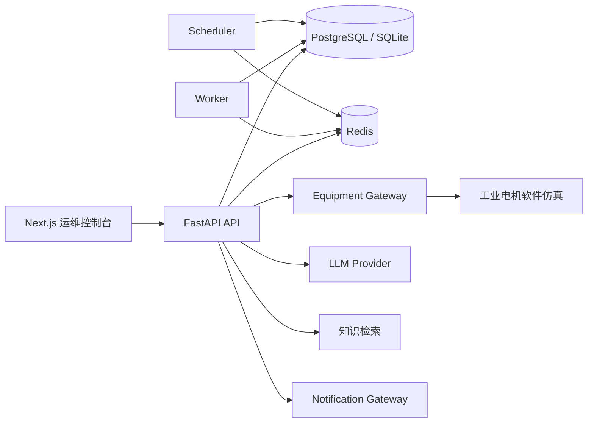
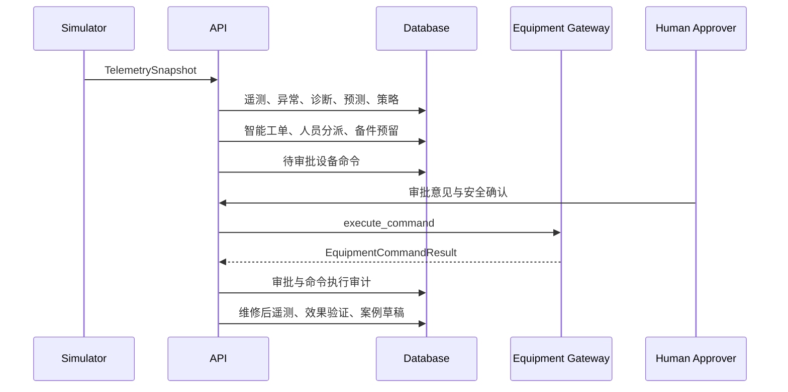

# 平台架构

## 运行架构

- Web 只访问同源 `/api`，`API_BASE_URL` 由 Next.js 服务端 rewrite 使用。
- API 承担认证、资产、遥测、诊断、工单、审批与验证事务。
- Worker 和 Scheduler 使用 PostgreSQL 与 Redis，并写入可验证心跳；首期不引入额外消息中间件。
- `EquipmentGateway`、`LLMProvider` 和 `NotificationGateway` 是所有外部系统的接入边界。
- 默认设备 Provider 是固定随机种子的 Mock，不连接 PLC、SCADA、OPC UA 或生产网络。

## 关键数据流

高风险命令没有绕过审批的公开执行 API。只有主管或管理员调用批准接口后，API 才会进入 Equipment Gateway。

## 部署边界

推荐生产结构为 Netlify Web、Render API/Worker/Scheduler、托管 PostgreSQL 与托管 Redis。API、数据库和 Web 必须协同发布；不得单独发布新版 Web 并继续连接旧 API。
