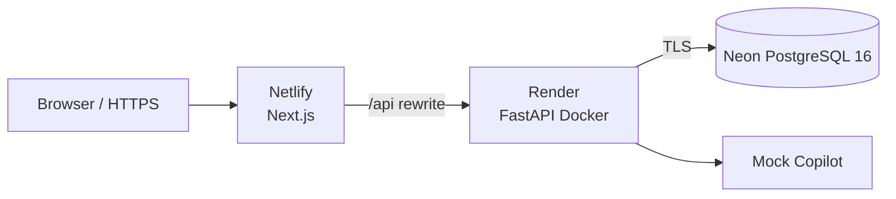

# Public Demo Deployment

本文档描述 v1.0.0 唯一正式演示栈：Netlify（Web）+ Render（API）+ Neon（PostgreSQL）。Railway 因当前环境没有可用登录态而未采用，也没有同时维护第二套生产部署。

## Architecture



公开地址：

- Web：`https://industrial-maintenance-copilot.netlify.app`
- API：`https://industrial-maintenance-copilot-api.onrender.com`
- Health：`https://industrial-maintenance-copilot-api.onrender.com/health`

## Platform Resources

| 资源 | 配置 |
| --- | --- |
| Netlify | Next.js 站点 `industrial-maintenance-copilot` |
| Render | Docker Web Service，Root Directory 为 `apps/api` |
| Neon | PostgreSQL 16，区域 `aws-ap-southeast-1` |
| AI | `AI_ENABLED=false`，不配置真实 LLM Key |

真实连接串、JWT Secret、平台 Token 和数据库密码只保存在平台 Secret 中。

## Database

Neon 使用独立应用角色连接 `maintenance` 数据库，连接串必须启用平台提供的 TLS/SSL 参数。应用配置会把平台常见的 `postgres://` 或 `postgresql://` 自动规范为 SQLAlchemy 的 `postgresql+psycopg://`。

项目没有使用 Alembic CLI。API 启动时按现有设计依次执行：

1. `upgrade_schema(engine)`：幂等兼容迁移；
2. `Base.metadata.create_all(bind=engine)`：创建缺失表；
3. `run_seed_if_empty()`：仅空库 Seed，重启不会重复插入。

迁移与 PostgreSQL 回归由 GitHub Actions 的 Backend job 验证。

## Render API

`render.yaml` 定义：

- `runtime: docker`
- `rootDir: apps/api`
- `healthCheckPath: /health`
- `autoDeployTrigger: commit`
- Free 实例规格

`apps/api/Dockerfile` 使用平台注入的 `$PORT`：

```text
python -m uvicorn app.main:app --host 0.0.0.0 --port ${PORT:-8000}
```

Render 环境变量：

| 变量 | 作用 | Secret |
| --- | --- | --- |
| `APP_ENV=demo` | 启用演示环境约束 | 否 |
| `DATABASE_URL` | Neon 应用角色连接串 | 是 |
| `SECRET_KEY` | JWT 签名 | 是 |
| `FRONTEND_URL` | 精确的 Netlify Origin | 否 |
| `AI_ENABLED=false` | 强制 Mock AI | 否 |
| `SEED_ON_STARTUP=true` | 空库自动 Seed | 否 |
| `STORAGE_TYPE=local` | 演示附件存储 | 否 |

`FRONTEND_URL` 必须精确设置为：

```text
https://industrial-maintenance-copilot.netlify.app
```

不要增加宽泛的 `*` CORS Origin。

## Netlify Web

`netlify.toml` 指定：

- Base directory：`apps/web`
- Build command：`npm run build`
- Publish directory：`apps/web/.next`
- Node.js：22
- 官方 Next.js Runtime：`@netlify/plugin-nextjs`

Netlify production 环境变量：

| 变量 | 值 |
| --- | --- |
| `API_BASE_URL` | `https://industrial-maintenance-copilot-api.onrender.com` |
| `NODE_ENV` | `production` |

浏览器请求相对地址 `/api/v1/...`，Next.js rewrite 再访问 Render。`DATABASE_URL`、`SECRET_KEY` 和 `LLM_API_KEY` 不得配置为 `NEXT_PUBLIC_*`。

手动生产部署：

```powershell
$env:NODE_OPTIONS=''
npx --yes netlify-cli@27.0.1 deploy --build --prod
```

`NODE_OPTIONS` 清空只用于避免本机工具注入影响构建，不是部署 Secret。

## Health and Smoke Checks

API 健康检查应返回 HTTP 200，且 `database` 为 `ok`：

```json
{"status":"ok","database":"ok","ai_enabled":false}
```

公开 Smoke：

```powershell
cd apps\web
$env:PUBLIC_DEMO_SMOKE='true'
$env:E2E_BASE_URL='https://industrial-maintenance-copilot.netlify.app'
$env:E2E_TECHNICIAN_EMAIL='tech@example.com'
npx playwright test e2e/public-demo-smoke.spec.ts --project=chromium
```

测试只读取关键业务路径和执行 Mock 问答，不改变工单生命周期。

## Demo Data Reset

`scripts/reset_demo_data.py` 不提供 HTTP 接口，不删除数据库结构或迁移元数据，只清空应用业务表并重新 Seed。执行必须同时满足：

- `APP_ENV=demo`
- `DEMO_RESET_ALLOWED=true`
- 命令行参数 `--confirm-public-demo-reset`

示例仅展示变量名：

```powershell
$env:APP_ENV='demo'
$env:DEMO_RESET_ALLOWED='true'
$env:DATABASE_URL='<platform-secret>'
python scripts/reset_demo_data.py --confirm-public-demo-reset
```

运行前确认 `DATABASE_URL` 指向公开演示数据库。完成后立即从本地会话和临时文件中清除连接串。

## Logs

- Render：检查 Deploy Events、Build Logs、Application Logs 和 `/health`。
- Netlify：检查 Deploy Logs、Functions Logs 与唯一 Deploy URL。
- Neon：检查连接数、查询活动和存储用量。
- GitHub Actions：Backend、Frontend、E2E 三个 job 必须全部成功。

日志中不得输出完整数据库 URL、JWT Secret、平台 Token 或 LLM Key。

## Rollback

1. Render：在 Events 中选择上一个已验证 Deploy 并执行 Rollback。
2. Netlify：在 Deploys 中将上一个已验证版本重新发布为 Production。
3. Database：应用迁移为向前兼容的幂等升级；若代码回滚不兼容，先恢复受控数据库备份。
4. Git：对 `master` 创建正常 revert 提交，不强推、不移动发布 Tag。

回滚后重新验证 `/health`、登录、知识检索、Mock Copilot 和工单详情。

## Troubleshooting

### Netlify returns 404 on dynamic routes

确认官方 Next.js Runtime 已运行，部署日志包含 Functions bundling；不要把项目导出为纯静态站点。

### Netlify blocks deployment

检查 Next.js 是否为官方安全修复版本。v1.0.0 使用 `15.1.12`，修复 React Server Components 相关安全公告。

### API cannot create tables

确认 Neon 应用角色对目标 database 和 `public` schema 具有 `USAGE`、`CREATE` 及所需表权限。

### Browser requests localhost

确认 Netlify 的 `API_BASE_URL` 是 HTTPS Render 地址，并重新构建；不要把 Docker 内部主机名暴露给浏览器。

### First request is slow

Render Free 实例会在闲置后休眠，首次请求可能延迟约 50 秒。公开 Smoke 为此使用 120 秒测试上限和 30 秒数据加载断言。

### Uploaded files disappear

当前 Render 本地文件系统不保证跨部署持久化。数据库是持久化的；附件应在后续版本迁移到对象存储。
