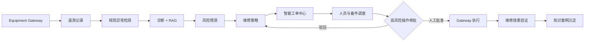

# 智能运维与预测性维护平台

## 产品闭环

## 首期场景

首期设备为三相工业电机及轴承系统。每个遥测快照包含：

- 振动 RMS（mm/s）
- 轴承温度（°C）
- 电机电流（A）
- 电机电压（V）
- 转速（rpm）
- 负载率（%）
- 环境温度（°C）
- 累计运行时间（h）

Mock 设备网关支持正常运行、温度缓慢上升、振动突然升高、电流持续过载、轴承磨损趋势、电压波动、传感器断连和多指标复合异常。固定随机种子保证 CI 与演示可重复。

故障分类覆盖轴承磨损、轴承过热、电机过载、转子不平衡、轴系不对中、润滑不足、电压异常、传感器异常和未知异常。规则输出包含异常证据、健康分、风险等级和置信度。

## Provider 与 Gateway

| 边界 | 首期实现 | 扩展方向 |
| --- | --- | --- |
| `EquipmentGateway` | `MockEquipmentGateway` | PLC、SCADA、OPC UA、MQTT 或厂商 API Adapter |
| `LLMProvider` | OpenAI 兼容客户端；无 Key 自动 Mock | 企业模型网关或本地模型 |
| `NotificationGateway` | 数据库站内通知 | 邮件、短信、Teams、Slack 或企业微信 |
| RAG | 关键词、设备类型、故障代码、历史工单加权 | 向量库或企业知识源 |

API 与业务服务只依赖这些边界，不直接依赖真实设备或第三方消息服务。

## 安全原则

平台没有直接设备命令 API。高风险动作先写入 `operation_approvals`：

1. Agent 或人员提出命令及风险理由。
2. 主管/管理员填写审批意见并确认维护窗口与 LOTO。
3. 只有批准接口才调用 `EquipmentGateway.execute_command`。
4. 执行结果、审批人、时间和备注全部留痕。
5. AI 诊断、预测和策略均为辅助信息，不替代现场专业判断。

## 主要 API

| 能力 | API |
| --- | --- |
| 智能运维总览 | `GET /api/v1/intelligence/overview` |
| 设备遥测与诊断 | `GET /api/v1/intelligence/equipment/{id}` |
| 遥测历史 | `GET /api/v1/intelligence/telemetry/{id}` |
| 异常、预测、策略 | `GET /api/v1/intelligence/anomalies`、`predictions`、`recommendations` |
| 结构化诊断 | `GET /api/v1/intelligence/diagnoses` |
| Agent/Tool 审计 | `GET /api/v1/intelligence/agent-runs`（主管/管理员） |
| 仿真配置 | `POST /api/v1/intelligence/simulator/configure` |
| 启动/暂停/重置/单步 | `POST /api/v1/intelligence/simulator/{action}` |
| 审批列表与申请 | `GET/POST /api/v1/intelligence/approvals` |
| 批准/驳回 | `POST /api/v1/intelligence/approvals/{id}/{action}` |
| 维修效果验证 | `POST /api/v1/intelligence/verifications` |

## Mock 演示

1. 使用主管或管理员账号登录。
2. 打开“实时状态监测”，选择工业电机与故障场景。
3. 保持默认随机种子，应用配置并点击“单步”数次或启动连续仿真。
4. 在“预测性维护”查看异常、剩余寿命、维修策略、人员与备件建议。
5. 高风险场景会自动创建预测性维护工单与待审批停机操作。
6. 在“高风险操作审批中心”填写安全确认后批准或驳回。
7. 工单完成并产生维修后遥测后，可调用维修效果验证；通过时关闭工单，失败时退回重做。
8. 验证案例以知识库草稿生成，等待人工审核后发布。

CI 固定 `AI_ENABLED=false`，不会调用付费模型。
